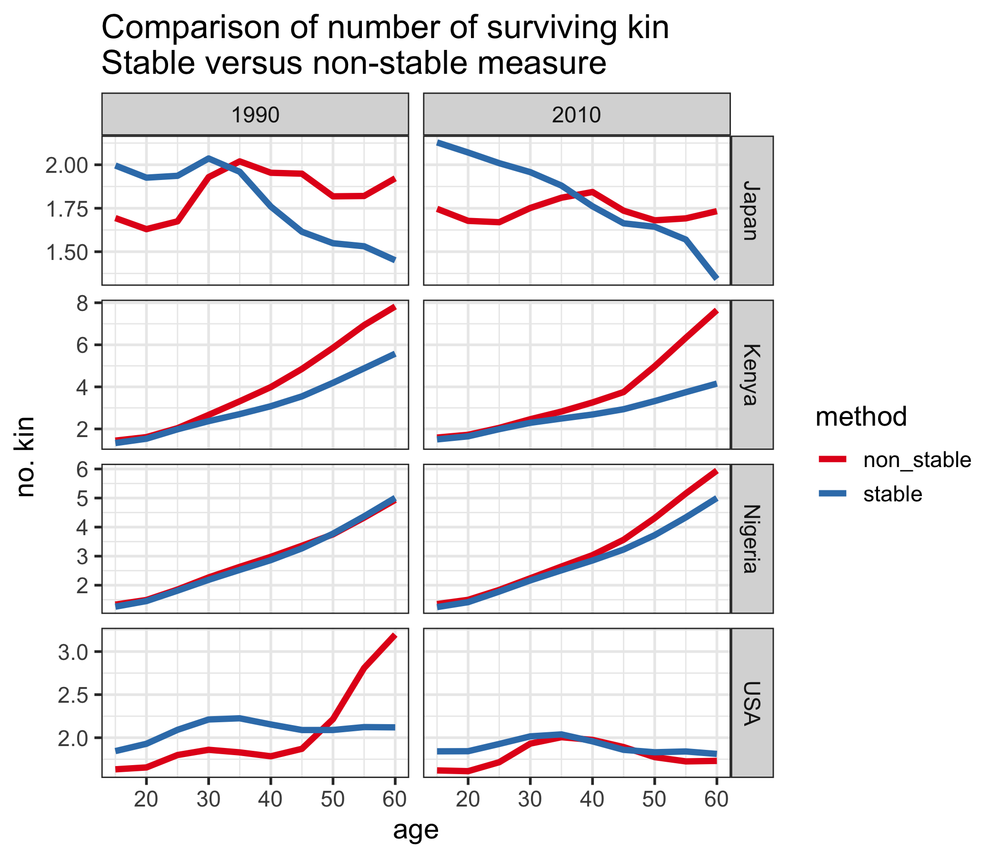
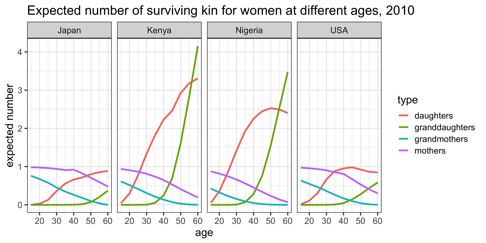
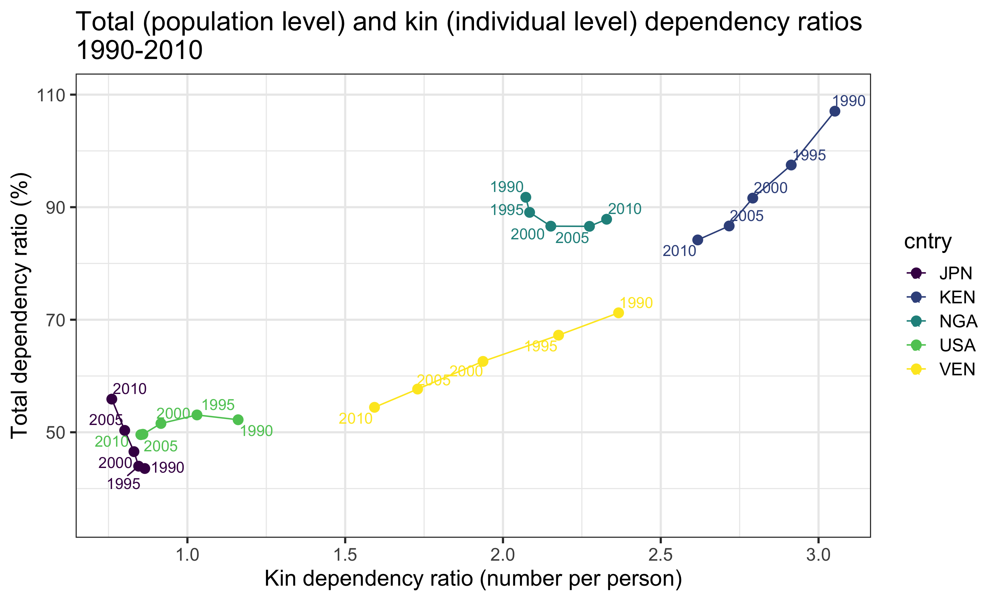
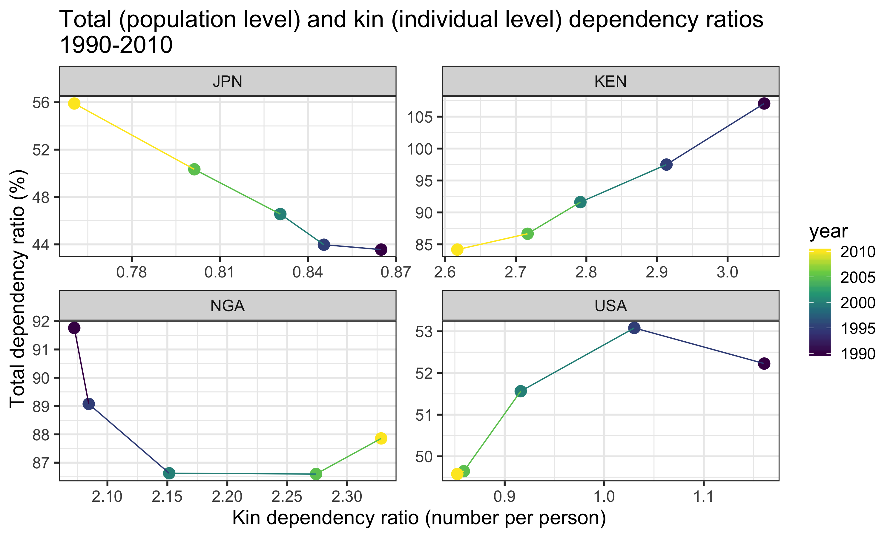

## Premise

Starting in the mid-1960s a line of demographic research began to develop a formal measurement strategy for estimating the number of living kin (hereafter: kin availability) from fundamental demographic rates. Recognizing that kinship (biologically-defined) was heavily determined by rates of fertility and mortality, population researchers began to elaborate a set of methods to estimate kin availability from these quantities. This research culminated in a set of formal life table equations by @Goodman1974 that enabled this estimation under stable population assumptions. These equations represented the strongest effort, at that time, to formally relate the structure of kinship to its demographic determinants; and they opened up exciting new possibilities for systematically exploring the relationship between fertility, mortality, and kinship wherever data on such quantities could be found.^[For notable examples of work in this tradition see: @Goldman1978, @Uhlenberg1980, @Hagestad1986, @Watkins1987]

In recent years, interest in demographic measurements of kin availability has been increasingly driven by material concerns surrounding the aging of populations. A 2015 report by the United Nations Population Division predicts that by the year 2050, the world's share of people aged 60 years or older will increase almost two-fold from one-in-eight persons to one-in-five [@UNPopDiv2015]. This unprecedented shift in the age distribution raises the question of how society will organize to materially support the post-retirement population as its growth outpaces that of the working-age population. 

A diverse literature has emerged surrounding this issue.^[For an extensive review, see @Lee2011] Broadly speaking, researchers distinguish between public and private mechanisms of old-age support. Public support systems, in this context, typically refer to public pension programs (e.g. _Social Security_ in the United States) or other in-kind transfer programs that are largely funded by the working age population. The _old age dependency ratio_ (OADR)---usually defined as the number of individuals 65 years or older divided by the number of "working-age" individuals (15-64 years old)---provides a rough measure of the likely support burden faced by these public systems.^[It is worth noting that alternative versions of the basic _old age dependency ratio_ (OADR) measure have been proposed. Perhaps the most prominent of these is the _prospective old age dependency ratio_ (POADR) [@Sanderson2005], which further adjusts for future gains in life expectancy.]

As for private mechanisms of old-age support, the family is the principal vehicle [@Lee2011a]. Especially in nations where public old age support is scarce, the family is likely to be the primary source of material support for dependent elders. Curiously, there are no widely-reported measures of expected family support burden like there are for the expected public support burden (i.e. the OADR just mentioned). This is likely due to the general dearth of data on kinship structures. While the OADR derives entirely from readily-observed population age distributions, an analogous _kin dependency ratio_ (KDR) would require information, not only about the age of individuals in a population, but also about how those individuals are related to one another via familial ties.

In this paper, we present an extended version of Goodman and Colleague's classic method of calculating kin availability as a reasonable estimation strategy when actual data on kinship is absent. Our method relies solely on readily-available age-specific fertility and mortality data and a set of easily-calculable life table equations. We improve on Goodman's original method by dropping the stationary population assumption, thus allowing for the estimation of kin availability as a function of demographic rates that need not be constant over time. Then, as a demonstration of the practical applicability of this type of estimation, we define a _kin dependency ratio_ as a measure of expected kin support burden, which we compare to existing _total age support ratios_ (a generalization of the OADR) across a sample of countries at different points in time. 

## The Original Method

In @Goodman1974, a method is laid out by which the expected number of living female relatives of different relations (e.g. mothers, daughters, etc.) is derived from age-specific rates of survival and fertility. For example, the number of surviving daughters to a woman of age $a$ ($a>{\alpha}$) at time $t$ is given by the formula:

$$
\int_{\alpha}^a l_{a-x} m_x dx
$$

Here, $m_x$ is the number of female births to a woman of age $x$ and $l_{a-x}$ is the proportion of girls surviving to age $a-x$ (i.e. alive when mother is age $a$). 

Applying the same logic recursively, a formula for the number of grand-daughters can be derived:

$$
\int_{\alpha}^a \left[\int_{\alpha}^{a-x}l_y m_y l_{a-x-y}dy \right] m_x dx
$$

Here, $y$ indexes the daughter's age (i.e. the age of the mothers of the grand-daughters being counted).

Now moving _up_ generations, the probability of mother's survival can also be written in terms of age-specific survival and fertility:

$$
M_1(a) = \int_{\alpha}^{\beta} \frac{l_{x+a}}{l_x} W(x|t-a)dx
$$

Here, $\frac{l_{x+a}}{l_x}$ is the mean probability that a mother who gave birth to a girl who is now age $a$ (when the mother was age $x$) is still alive; and $W(x|t-a)$ is the age distribution (at time $t-a$) of women who gave birth to a daughter at time $t-a$. 

Conveniently, the $M(a)$ function can be recursively re-written to characterize the probability of any older-generation maternal ancestor. For example, grandmother's survival is given by:

$$
M_2(a) = \int_{\alpha}^{\beta} M_1(a+x) W(x|t-a)dx
$$

{>> Monica, can you look over and let me know if I've screwed anything up or should include more description? <<}

## The Extended Method

The main extension of Goodman's method, which we present here, is to allow rates of fertility and mortality to vary over time. Accounting for this variation is important because: (a) rates of fertility and mortality across much of the world have shifted dramatically over the last several decades; and (b) the availability of living kin is likely to be highly sensitive to generational changes in these rates. As written and presented, the original kin availability equations by @Goodman1974 assume that age-specific rates of survival and fertility remain constant. In order to derive more historically-plausible estimates of kin availability from these data, we propose a simple set of adjustments that allow time to enter the equation in an intuitive way.

{>> Monica, can you provide a description of how we do the adjustment? things to include: non-stable equations for daughter, grand-daughter, mother, and grandmother; the period mean age adjustment factor, why we can't simply use cohort info to do the adjustment (lack of data), and our comparison of results derived using it to Goodman's un-adjusted results. <<}

{width=600px}

In Figure 1, we plot total kin counts (i.e. the sum of grandmothers, mothers, daughters, and grand-daughters) over age and period for a selection of countries. We do this using both the original Goodman method (labeled "stable") and our extended method (labeled "non_stable"). What we observe is... 

{>> Monica, can you complete? Perhaps speculate a bit about why we observe the differences that we do (e.g. Nigeria's vital rates have remained largely stable for a while, while Japan's has not... something like that?) and why our curve is more right than Goodman's. <<}

## The Kin Dependency Ratio (KDR)

We define a _kin dependency ratio_ (KDR) as the number of plausibly dependent kin at age $x$ divided by the number of plausibly non-dependent kin at age $x$:

$$
KDR(x) = \frac{\text{dependent kin at age x}}{\text{non-dependent kin at age x}}
$$

"Dependent kin" is defined along two dimensions: (1) The type of kin; and (2) the age of ego. For example, a daughter or grand-daughter is likely to be a dependent when ego is younger, but when ego is older, those same daughters and grand-daughters are likely to be independent (and possibly even sources of material support). For the purposes of the present demonstration, we define _dependent kin_ to be daughters and grand-daughters when ego is 44-years or younger; daughters, granddaughters, mothers, and grandmothers when ego is age 45 to 64; and mothers and grandmothers when ego is 65-years or older (Table 1).

**Table 1.** Dependent kin types by age of ego

| Ages      | Who counts as "dependent kin"?                      |
| :-------: | --------------------------------------------------- |
| 0--44     | daughters, grand-daughters                          |
| 45--64    | daughters, grand-daughters, mothers, grandmothers   |
| 65+       | mothers, grandmothers                               |

These age boundaries are based on our own sense of plausible values, but could---in better practice---be defined in any number of more scientifically-rigorous ways. However, for the sake of demonstration, they suit our needs well enough.

The following is a plot of KDR over ages for a selection of countries in the year 2010 (Figure 2).

{width=800px}

{>> PAUL WILL ADD: Quick summary of notable features of the country-specific KDR curves. <<}

## KDR vs. TADR

A more general version of the _old age dependency ratio_ (OADR) is called the _total age dependency ratio_ (TADR). The TADR includes in its numerator, not only those 65-years and older, but also those 14-years and younger. The motivation for a measure like the TADR is that while the OADR can be viewed as a rough measure of the old-age support burden faced by public programs funded largely by the working age population, the TADR can be viewed as a rough measure of the old-age _plus_ the young-age burden faced by these public programs. The KDR (examined over the so-called "working ages," 14-64), can be viewed similarly as a rough measure of the _private_ support burden faced by families. Thus, comparing the TADR and the KDR can provide a useful (even if rough) summary of the likely _public_ versus _private_ support burden that comes with population aging. 

The following is a plot of the mean KDR (measured over ages 14-64) and the OADR over time for a selection of countries that vary in their relative levels of economic development.

{width=800px}

{>> PAUL WILL ADD: Quick summary of notable features. <<}

A striking feature of the association between TADR and KDR is how much this association varies over time within countries...

{>> PAUL WILL COMPLETE THIS SECTION <<}

<!-- Note to self: probably these differences in time-trends are resolved if we look at the fertility trend in each country... -->

{width=800px}

{>> PAUL WILL ADD: Quick summary of notable features. <<}

//////// PROBABLY OMIT FOR PAA /////////

Because trends in both mortality and fertility can influence the OADR and KDR in different ways, we also track the movement of country-specific OADR and KDR curves over a mortality vs. fertility surface.

* PLOT: Country-specific KDR(at working ages) and OADR tracked over fertility/mortality surface
    * x: fertility(TFR or some ASFR)
    * y: mortality(e0 or some ASMR)
    * lines: one for OADR and one for KDR (for each country over a sequence of decades)

//////// PROBABLY OMIT FOR PAA /////////

## Next Steps
In the final paper, we plan to expand the scope of this project in three directions.

1. **Account for additional kin relations**: For the purposes of this extended abstract, we have only considered grandmothers, mothers, daughters, and granddaughters in our calculations, but in the final paper we intend to broaden our scope to include equations for other types of kin: sisters, aunts, cousins, and nieces. 

2. **Validate kin availability estimates**: We will compare the estimates of kin availability derived via our method against kin counts derived from a set of nationally-representative surveys.^[In the United States, for example, large-scale surveys like the _General Social Survey_ and the _Health and Retirement Survey_ contain questions regarding surviving family members.]

3. **Build an R package**: To enhance the practical usefulness of our method, we are preparing an R package that will enable researchers to easily implement it to derive expected numbers of kin given data on age-specific rates of fertility and mortality.  

## References