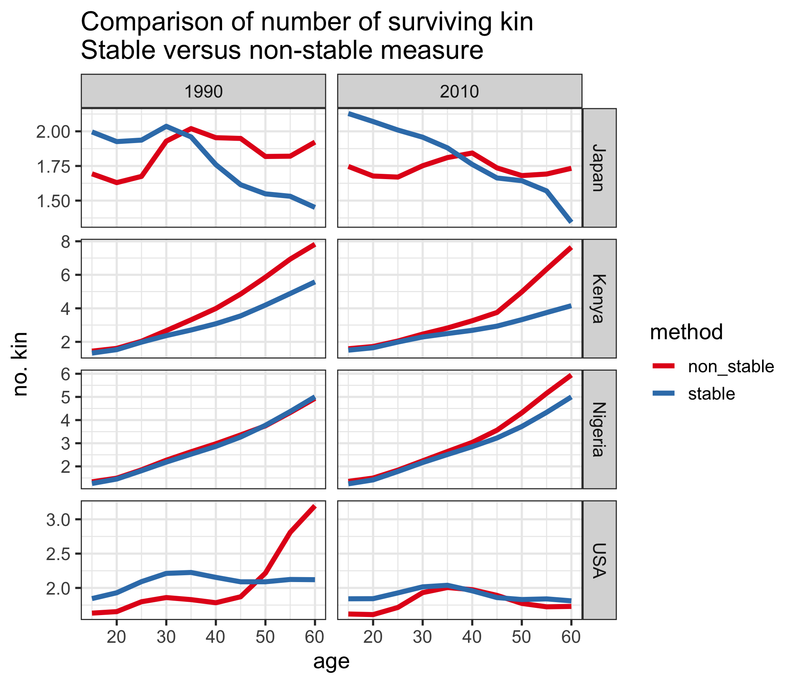
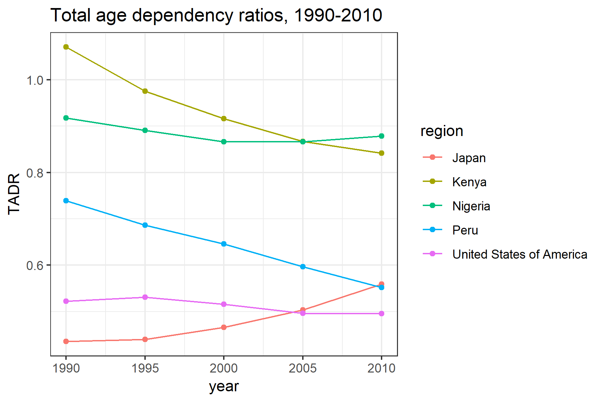
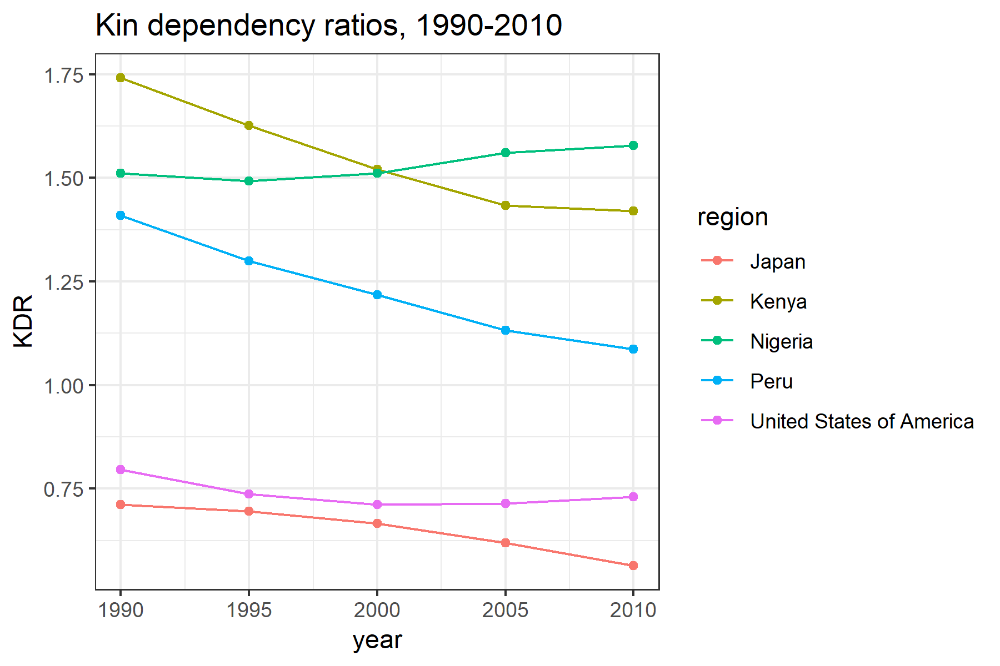
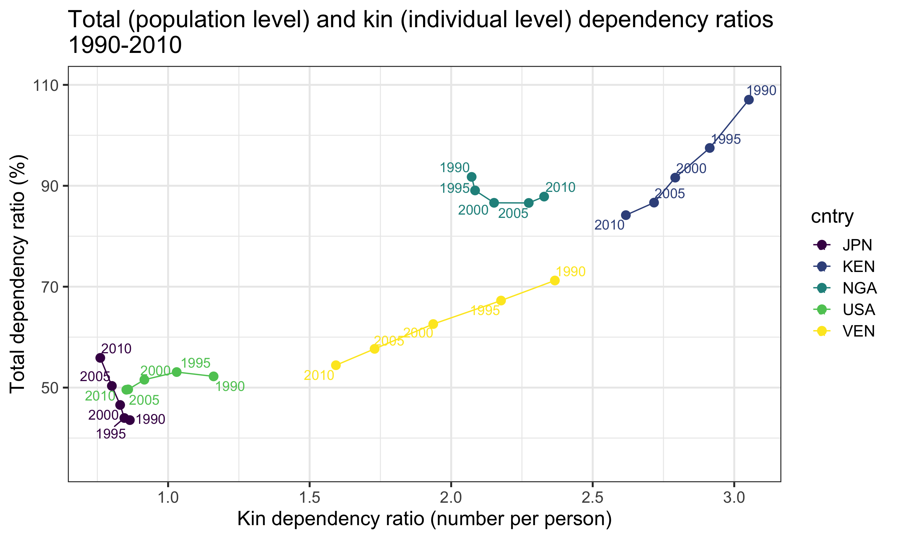
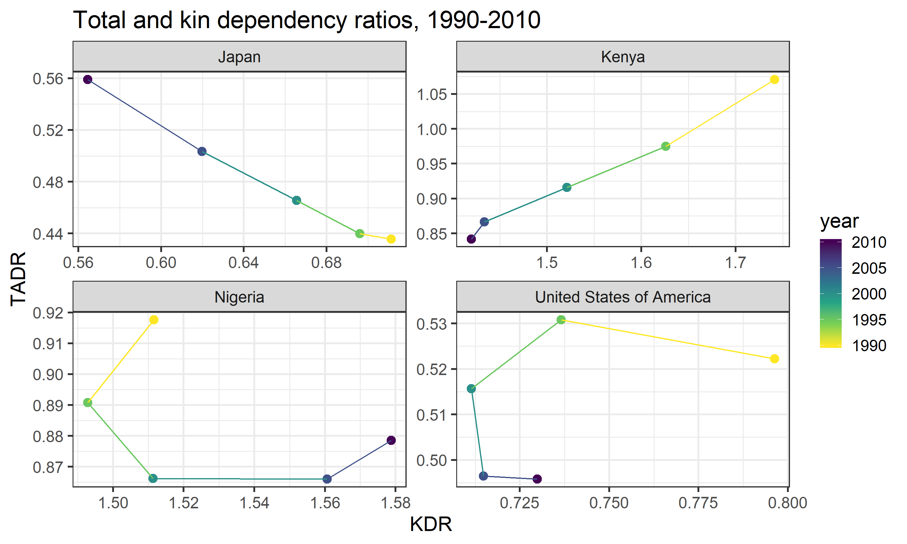
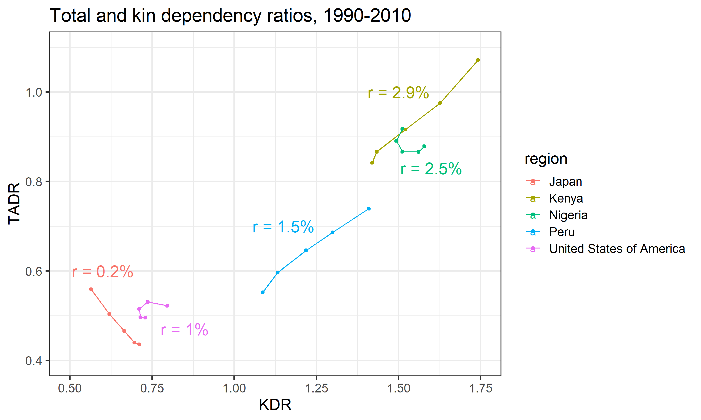
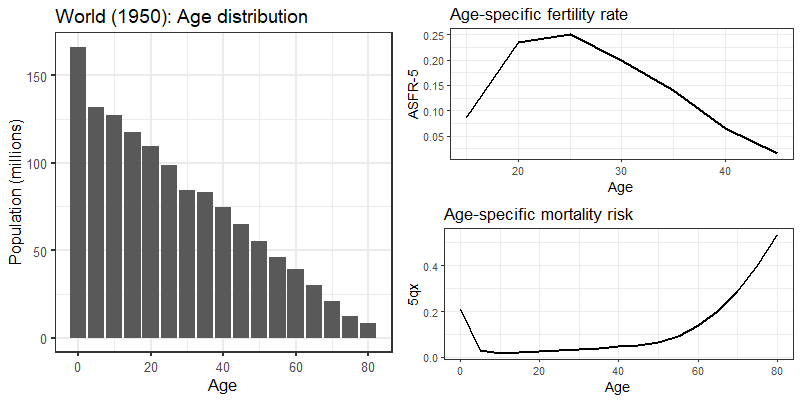
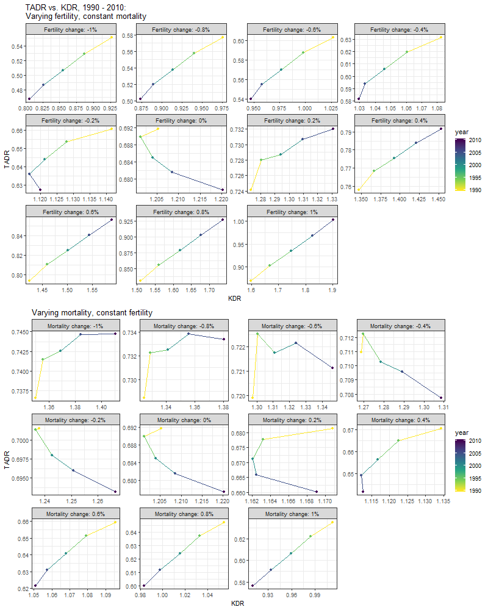
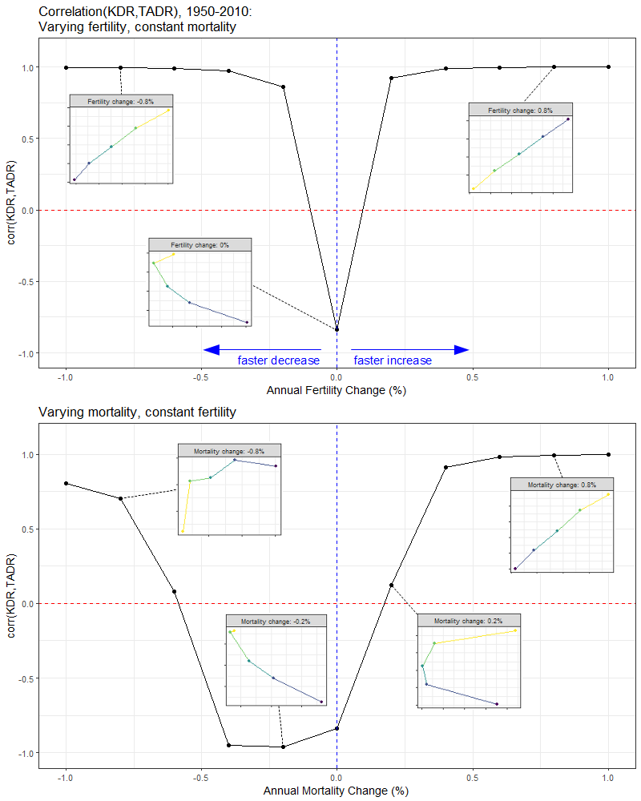

<!-- 
ALTERNATIVE ABSTRACT (contains validation sentence): 
    "We introduce a set of life table equations for estimating the number of living kin over ages using readily-available data on fertility and mortality. These equations extend the classic measurement strategy of Goodman et al. (1974, 1975) by offering a way to estimate kin counts under demographic conditions that may vary over time. To check the plausibility of our method's estimates, we compare them to kin counts reported in a set of large, nationally-representative surveys. We then demonstrate a practical application of this technique: the derivation of a _kin dependency ratio_ (KDR)---a measure of expected kin support burden---which we compare to the _total age dependency ratio_ (TADR), a commonly-reported measure of public support burden in aging populations. We end with a discussion about the strengths and limitations of our method, and ways that future work may improve it." 
-->

# Introduction

Starting in the mid-1960s a line of demographic research began to develop a formal measurement strategy for estimating the number of living kin (hereafter: kin availability) from fundamental demographic rates. Recognizing that kinship (biologically-defined) was heavily determined by rates of fertility and mortality, population researchers began to elaborate a set of methods to estimate kin availability from these quantities. This research culminated in a set of formal life table equations by @Goodman1974 that enabled this estimation under stable population assumptions. These equations represented the strongest effort, at that time, to formally relate the structure of kinship to its demographic determinants; and they opened up exciting new possibilities for systematically exploring the relationship between fertility, mortality, and kinship wherever data on such quantities could be found.^[For notable examples of work in this tradition see: @Goldman1978, @Uhlenberg1980, @Hagestad1986, @Watkins1987]

In recent years, interest in demographic measurements of kin availability has been increasingly driven by material concerns surrounding the aging of national populations. A 2015 report by the United Nations Population Division predicts that by the year 2050, the world's share of people aged 60 years or older will increase almost two-fold from one-in-eight persons to one-in-five [@UNPopDiv2015]. This unprecedented shift in the age distribution raises the question of how society will organize to materially support the post-retirement population as its growth outpaces that of the working-age population. 

A diverse literature has emerged surrounding this issue.^[For an extensive review, see @Lee2011] Broadly speaking, researchers distinguish between public and private mechanisms of old-age support. Public support systems, in this context, typically refer to public pension programs (e.g. _Social Security_ in the United States) or other in-kind transfer programs that are largely funded by the working age population. The _old age dependency ratio_ (OADR)---usually defined as the number of individuals 65 years or older divided by the number of "working-age" individuals (15-64 years old)---provides a rough measure of the likely support burden faced by these public systems.^[It is worth noting that alternative versions of the basic _old age dependency ratio_ (OADR) measure have been proposed. Perhaps the most prominent of these is the _prospective old age dependency ratio_ (POADR) [@Sanderson2005], which further adjusts for future gains in life expectancy.]

As for private mechanisms of old-age support, the family is the principal vehicle [@Lee2011a]. Especially in nations where public old age support is scarce, the family is likely to be the primary source of material support for dependent elders. Curiously, there are no widely-reported measures of expected family support burden like there are for the expected public support burden (i.e. the OADR just mentioned). This is likely due to the general dearth of data on kinship structures. While the OADR derives entirely from readily-observed population age distributions, an analogous _kin dependency ratio_ (KDR) would require information, not only about the age of individuals in a population, but also about how those individuals are related to one another via familial ties. 

In this paper, we present an extended version of Goodman and Colleague's classic method of calculating kin availability as a reasonable alternative when actual data on kinship is absent. Our method relies solely on readily-available age-specific fertility and mortality data and a set of easily-calculable life table equations. We improve on Goodman's original method by dropping the stable population assumption, thus allowing for the estimation of kin availability as a function of demographic rates that need not be constant over time. <!-- As validation, we compare the results of this procedure against kin network estimates from a set of nationally-representative surveys. --> Then, as a demonstration of the practical applicability of this type of estimation, we define a _kin dependency ratio_ as a measure of expected kin support burden, which we compare to existing _total age support ratios_ (a generalization of the OADR) across a sample of countries at different points in time. We end with a discussion about the strengths and limitations of this technique in modern populations, and future opportunities for improvements to kinship measurement in demographic research.

# Measuring Kin Availability

The formal demography of kinship estimation has had a long history. Perhaps the earliest example is work published in 1931 by Alfred Lotka, which derived life table equations to estimate orphanhood rates from data on mortality and the mean age of childbearing [@Lotka1931]. Subsequent work by Jean Fourastié, derived estimates of marital duration (joint survival time of husband and wife) from data on mortality rates [@Fourastie1959]; and Heer and Smith used similar methods to estimate the likelihood of elderly parents having surviving children [@Heer1968].

By the mid-1960s, Goodman, Keyfitz, and Pullum [-@Goodman1974;-@Goodman1975] had elaborated a set of life table equations that allowed for the calculation of age-specific survival for a wide range of kin relations (henceforth: the "Goodman Equations"). These equations provided perhaps the most complete formalization of these methods up to that point (we discuss these equations in detail in an upcoming section). However, these equations operated under a set of strong assumptions that limited the generalizability of the estimates they produced.

Three limitations, in particular, are worth highlighting here. First, the Goodman Equations (in their original formulation) assume stable fertility and mortality rates. This makes estimates of kinship derived for populations experiencing substantial real fluctuation in their fertility and/or mortality much less reliable. Second, these equations assume that fertility rates are parity-agnostic (i.e. all women have the same probability of childbearing no matter how many children they've already had). This has the potential to bias the estimated number of kin depending on the level and parity-distribution of fertility control exercised in a population. Finally, these equations only account for women and their female kin. 

These limitations were later addressed by a line of computational demography starting in the 1970s that sought to leverage computer-driven microsimulation techniques to estimate various kinship quantities [@Zhao2006]. The two most prominent microsimulation systems to emerge from this work were SOCSIM and CAMSIM[^sim_bg] (though in recent years, SOCSIM has seen much more active use in published research[^sim_eg]). Both were designed to allow for the modeling of population composition and dynamics by _aggregating up_ the behavior of simulated individuals constrained to reproduce and die according to known fertility and mortality rate inputs. Notably, these microsimulation systems could account for time-varying demographic rate schedules, parity-specific fertility, and two-sex populations.

[^sim_bg]: SOCSIM was developed primarily at UC Berkeley as result of a collaboration between Peter Laslett, Eugene Hammel, and Kenneth Wachter. Laslett later worked with James Smith and Jim Oeppen to develop CAMSIM at Cambridge University.

[^sim_eg]: For examples of recent work using SOCSIM, see @Murphy2011, @Verdery2017, and @Chung2018.

# Re-introducing a Lifetable Approach to Kinship Measurement

Today, there remain plenty of uses for reliable measurements of kin availability. However, the current state-of-the-art---i.e. microsimulation---methods for deriving these measurements are computationally expensive and difficult to properly set up and calibrate. Even if the computational resources are available, many researchers are unlikely to have the time or desire to spend the requisite number of hours to learn, design, implement, and validate a demographic microsimulation model. Thus, it seems worth considering alternative measurement strategies that might be able to get us "close enough" without the extreme up-front cost demanded by a microsimulation strategy.

One option---the one we advocate in this article---is to re-visit the Goodman Equations. In the previous section, we had noted that these equations provided a relatively straightforward method for estimating kin availability given readily-available data on population-level fertility and mortality. However, we also noted the three primary limitations of these equations: (a) the assumption of constant demographic rates; (b) parity-agnostic fertility rates; and (c) female-only estimates. The first of these, the assumption of constant demographic rates, arguably pose the most serious issues when considering the utility of the resulting estimates. This is because mortality and fertility rates have changed quite markedly for most countries over recent history. <!-- In contrast, averaging fertility across parity (i.e. using parity-agnostic rates) is not likely to dramatically bias estimates when parity-specific control of fertility behavior is not too prominent or when overall fertility levels are low; and single-sex models of kinship are only problematic if interpretation is conducted ignoring this fact -->. 

In order to leverage the convenience of the Goodman Equations, while mitigating this primary limitation, we propose an extension of these equations, which allows for time-varying fertility and mortality rate inputs. In the following sections, we first describe the original Goodman method. Second, we explain our proposed extension of the original method; and then we formally compare estimates of kin availability derived from the original method to estimates derived from the extended method. 

<!-- 
SCRAPS:
Outside of these computational methods, the two most common methods for estimating kin availability include direct measurement via household surveys and specialized social network questionnaires (often embedded as occasional modules in larger social surveys). 
    - describe strengths and weaknesses of household surveys (e.g. Census):
        + household boundaries: CITE Ruggles and others in Burch (1979)
        + growing institutionalized populations: CITE prison studies re: black families
    - describe strengths and weaknesses of social network questionnaires:
        + infrequently administered (limited time points observed)
        + dependent on respondent recall (list methods can also impose artificial limits on number of kin)  
        
- to this set, we hope to add a third viable alternative that has the advantage of (a) not being constrained by household boundaries and (b) relying solely on already existing and (in most cases) publicly-accessible data covering a much wider range of years than existing social survey data. 
-->

## The Original Method

In @Goodman1974, a method is laid out by which the expected number of living female relatives of different relations (e.g. mothers, daughters, etc.) is derived from age-specific rates of survival and fertility. For example, the number of surviving daughters to a woman of age $a$ ($a>{\alpha}$) at time $t$ is given by the formula:

$$
\int_{\alpha}^a l_{a-x} m_x dx
$$

Here, $m_x$ is the number of female births to a woman of age $x$ and $l_{a-x}$ is the proportion of girls surviving to age $a-x$ (i.e. alive when mother is age $a$). 

Applying the same logic recursively, a formula for the number of grand-daughters can be derived:

$$
\int_{\alpha}^a \left[\int_{\alpha}^{a-x}l_y m_y l_{a-x-y}dy \right] m_x dx
$$

Here, $y$ indexes the daughter's age (i.e. the age of the mothers of the grand-daughters being counted).

Now moving _up_ generations, the probability of mother's survival can also be written in terms of age-specific survival and fertility:

$$
M_1(a) = \int_{\alpha}^{\beta} \frac{l_{x+a}}{l_x} W(x|t-a)dx
$$

Here, $\frac{l_{x+a}}{l_x}$ is the mean probability that a mother who gave birth to a girl who is now age $a$ (when the mother was age $x$) is still alive; and $W(x|t-a)$ is the age distribution (at time $t-a$) of women who gave birth to a daughter at time $t-a$. In their original paper, the authors assume a stable population, such that 

$$W(x|t-a) = W(x) = l_xm_xe^{rx}$$

where $r$ is the intrinsic population growth rate. Conveniently, the $M(a)$ function can be recursively re-written to characterize the probability of any older-generation maternal ancestor. For example, grandmother's survival is given by:

$$
M_2(a) = \int_{\alpha}^{\beta} M_1(a+x) W(x|t-a)dx
$$

Additional equations for the survival of sisters, aunts, nieces, and female cousins are also provided in @Goodman1974. However, for the purposes of the present study, we limit our focus to just the following vertically-nuclear kin relations: grandmothers, mothers, daughters, and granddaughters.

## A Non-Stable Method

The main extension of Goodman's method, which we present here, is to allow rates of fertility and mortality to vary over time. Accounting for this variation is important because: (a) rates of fertility and mortality across much of the world have shifted dramatically over the last several decades; and (b) the availability of living kin is likely to be highly sensitive to generational changes in these rates. As written and presented, the original kin availability equations by @Goodman1974 assume that age-specific rates of survival and fertility remain constant. In order to derive more historically-plausible estimates of kin availability from these data, we propose a simple set of adjustments that allow time to enter the equation in an intuitive way.

If cohort rates were readily available, we would be able to calculate the above expressions representing the true changes in fertility and mortality over time. However, in practice usually only period data are readily available across a wide range of counties. In addition, the cohort approach quickly becomes rather data intensive, given the number of different cohorts involved in each of the calculations. For example, if we were trying to calculate the expected number of daughters to a mother aged 50, we would need the full set of cohort fertility rates for that mother, plus survival information for seven separate cohorts for the daughters. 

To best utilize the period data available, we index Goodman's method to the mean age at childbearing. This centers the period fertility schedule so that the fertility rates at the time of peak childbearing (25-30 years) is correct for that particular cohort of women. For daughters, the equation becomes

$$
\int_{\alpha}^a l_{a-x}(t^*) \cdot m_x(t^*) dx
$$

where $t^*$ is the year in which the woman of age $a$ achieved the mean age at childbearing $A$. Thus $m_x(t^*)$ is the fertility rate at age $x$ in the year $t^*$. If age $a$ is less than $A$, then $t^*$ is just set to be the current period. Note that the mean age of childbearing may vary depending on the population and time period being considered. 

In a similar way, the expected number of surviving granddaughters is estimated as:

$$
\int_{\alpha}^a \left[\int_{\alpha}^{a-x}l_y(t^*) \cdot m_y(t'_x) \cdot l_{a-x-y}(t'_x)dy \right] m_x(t^*) dx
$$

where $t'$ is the year in which the daughters who were born when the woman was age $x$ reach mean child bearing age. This year changes based on the age $x$. 

For the older kin, i.e. mothers and grandmothers, we utilize Goodman's original formulation where the age distribution of women of reproductive age is a function of time, i.e. $W(x|t-a)$. Thus the formulas are as above in the previous section. Both survival quantities are indexed to time $t$. 

In Figure 1, we plot total kin counts (i.e. the sum of grandmothers, mothers, daughters, and grand-daughters) over age for a selection of countries in 1990 and 2010. We compare the original Goodman method (labeled "stable") and the non-stable method presented above (labeled "non_stable"). Period fertility and mortality rates, and age distributions are obtained from the 2017 edition of the World Population Prospects, produced by the United Nations.^[All data are available online: https://population.un.org/wpp/] 

{width=600px}

For most countries, there is a noticeable difference in the estimates produced by the two methods. The exception is Nigeria in 1990, where fertility and mortality rates were such that the population was almost stable, so the two methods are very similar. By 2010, Nigeria's fertility had declined, and so the stable method does not account for higher fertility in the past, as illustrated by the discrepancy at older ages. The same is true for Kenya. For Japan, there are discrepancies at both young and old ages, due to both a decline in fertility and mortality rates. In the USA, noticeably the stable method in 1990 does not account for the baby boom, which substantially increases the number of kin for 50-60 year olds. 

Figure 2 shows the expected number of surviving kin over age for a selection of countries in the year 2010, broken down by kin type. 

{width=800px}

The most striking feature of these plots is the much larger expected numbers of daughters and grand-daughters in Kenya and Nigeria (versus the USA or Japan) at each age. This is, of course, a function of historically higher birth rates in these countries. On the other hand, we observe much higher expected numbers (i.e. survival probabilities) of mothers and grand-mothers in the USA and Japan (versus Kenya or Nigeria) at each age. This is a consequence of historically lower death rates in these countries. Thus, we see how both the fertility and mortality experiences of these populations are naturally reflected in these kin availability estimates. 

# Comparing Public and Private Support Burden

Having established a method to estimate historically-plausible counts of surviving kin, we now use it to construct a measure of within-family support burden, which we label the _kin dependency ratio (KDR)_. We will examine the relationship between this KDR and the _total age dependency ratio (TADR)_, a well-established index of public support burden. The motivation for a measure like the TADR is that it can be viewed as a rough measure of the support burden faced by public programs funded largely by the working age population. The KDR, can be viewed similarly as a rough measure of the _private_ support burden faced by families. Thus, comparing the TADR and the KDR can provide a useful (even if rough) summary of the likely _public_ versus _private_ support burden that comes with population aging. 

For data, we rely on the United Nations' World Population Prospects [@DepartmentofEconomicandSocialAffairs2017], which reports fertility rates, mortality rates, and age distributions for all its member nations. In the present study, we select a small, but demographically-varied, subset to examine in detail: Japan, Kenya, Nigeria, Peru, and the United States.

## Total Age Dependency Ratio (TADR)

The _total age dependency ratio_ (TADR) is a more general version of the _old age dependency ratio_ (OADR). The TADR includes in its numerator, not only those 65-years and older, but also those 14-years and younger. It is typically defined for a particular calendar year:

$$ 
TADR(y) = \frac{\text{people aged 0-14 & 65+ in year y}}{\text{people aged 15-64 in year y}}
$$

Figure 3 illustrates the TADR for our selected countries over the period 1990--2010. Across all years, we observe higher TADR in Kenya and Nigeria than in the United States and Japan. Peru, for most of this period, has fallen somewhere in between. These patterns are primarily due to a history of much higher fertility in the former set of countries, which has lead to a much larger proportion of younger individuals. Over time, the TADR in Kenya and Peru has decreased due to slowing birth rates and declining mortality, while in Japan, the TADR has increased due to consistently low birth and mortality rates, which has resulted in a rapidly aging population. In Nigeria and the United States, the TADR has remained relatively constant.

{width=700px}

## Kin Dependency Ratio (KDR)

We define a _kin dependency ratio_ (KDR) as the number of plausibly dependent kin at age $x$ divided by the number of plausibly non-dependent kin at age $x$:

$$
KDR(x) = \frac{\text{dependent kin at age x}}{\text{non-dependent kin at age x}}
$$

"Dependent kin" is defined along two dimensions: (1) The type of kin; and (2) the age of ego. For example, a daughter or grand-daughter is likely to be a dependent when ego is younger, but when ego is older, those same daughters and grand-daughters are likely to be independent (and possibly even sources of material support). In the present study, we will only account for the following relatives: grandmothers, mothers, daughters, and grand-daughters. We acknowledge that other relatives---e.g., sisters, cousins, aunts, and nieces---can certainly all be additional sources of support and strain in the lives of individuals at various moments. However, for the purposes of determining likely dependency status, we suspect the four types of kin we've chosen are likely to have the least ambiguous co-dependency relationships across most national contexts.

Furthermore, we parameterize the KDR with two _age threshold parameters_, $a_1$ and $a_2$, that demarcate three life stages indicating three distinct kin support regimes: (1) below $a_1$, during _early adulthood_, only younger generation kin are counted as dependents; (2) between $a_1$ and $a_2$, during _middle adulthood_, both younger and older generation kin are counted as dependents; and (3) above $a_2$, during _late adulthood_, only older generation kin are counted as dependents.

For example, if we assume $a_1 = 44$ and $a_2 = 65$, daughters and grand-daughters are counted as dependent kin when ego is 44-years or younger; daughters, granddaughters, mothers, and grandmothers are counted as dependent kin when ego is age 45 to 64; and mothers and grandmothers are counted as dependent kin when ego is 65-years or older (Table 1).

**Table 1.** Dependent kin by age of ego ($a_1 = 44$; $a_2 = 65$)

| Life Stage       | Ages      | Who counts as "dependent kin"?                      |
| :-----:          | :-------: | --------------------------------------------------- |
| Early Adulthood  | 0--44     | daughters, grand-daughters                          |
| Middle Adulthood | 45--64    | daughters, grand-daughters, mothers, grandmothers   |
| Late Adulthood   | 65+       | mothers, grandmothers                               |

It is worth reiterating that these age boundaries are just one set of plausible values. In reality, they are likely to vary by national and historical context. The parameters $a_1$ and $a_2$ enable researchers with greater domain-knowledge to set these boundaries in more sensible ways. For the purposes of this study, however, we calculate KDR with the $a_1$ and $a_2$ values given above---44 and 65, respectively---to enable uniform comparison across our selected countries.^[One might think of this methodological choice as a form of _indirect standardization_ whereby we hold the age-specific definition of dependent kin constant, while allowing the age distribution of kin to vary. This allows us to isolate the effect on KDR of differences in population composition rather than differences in the age-specific definition of "dependent kin".]

To consider the kin dependency ratio over the whole population, we take the weighted average of the age-specific KDRs, where the weights are based on the age distribution of the population:

$$
KDR = \sum_{x=0}^{85} \frac{KDR(x) \cdot w_x}{\sum w_x}
$$

where $w_x$ is the proportion of the female population aged $x$. 

The following is a plot of KDR for our selected countries over the period 1990--2010 (Figure 4). For Kenya and Peru, the KDR has decreased over time as both fertility and mortality has declined. In Nigeria, while fertility has also declined, it has declined much more slowly, which coupled with persistently high mortality rates, has led to an increase in the KDR. In Japan, declining mortality rates couples with historically low fertility rates has lead to lower KDR, while in the United States the KDR has remained relatively constant. 

{width=700px}

### The 'kindr' Package

To enhance the accessibility of the KDR index, we have developed an R package ('kindr'), which automates the calculation given age-specific fertility rates, mortality rates, population counts, and user-specified $a_1$/$a_2$ parameter values. Further details regarding _kindr_ (its installation and use) are provided in the technical appendix.

## KDR vs. TADR

The following is a plot of the mean KDR (measured over ages 14-64) and the TADR over the period 1990--2010 for a selection of countries that vary in their demography and relative levels of economic development.

{width=800px}

In general, we observe what we expect: KDR tends to increase along with TADR. That is to say, as the ratio of "dependent" age groups to the "working-age" group increases, so too does the ratio of "dependent" kin to non-"dependent" kin. However, this association does not hold perfectly in all cases. If we look closely at the plot in Figure 5, we see that the relationship between KDR and TADR varies greatly across different national contexts (Figure 6). 

{width=800px}

In Kenya, for example, we see a positive, nearly linear correlation between KDR and TADR over time. This aligns well with the general trend observed in Figure 5: TADR and KDR increases or declines at roughly similar speeds. In Japan, this relationship appears to flip altogether---KDR actually declines linearly as TADR increases over time. In all of our other countries, however, we see deviations from either of these simpler patterns. In the USA and Nigeria, there is a markedly non-linear relationship between KDR and TADR over time---KDR does not always move in the same direction as TADR. 

In summary, the relationship between KDR and TADR is not constant. It can vary dramatically over time and across different national populations. To the extent that KDR and TADR can be interpreted as measures of, respectively, the _private_ and _public_ support burdens faced by countries, understanding the shape and source of the variation in the KDR-TADR relationship may help inform the future work of researchers and policy-makers as they prepare for the aging of their populations. <!-- Maybe move this paragraph to the 'Conclusion'? -->

## Explaining the Relationship between KDR and TADR

So what accounts for the non-uniform relationship between KDR and TADR across different national contexts? The answer, in brief, is national differences in the historical trajectory of fertility and mortality rates. These differences can be described along two dimensions: (1) differences in _levels_; and (2) differences in the _rate of change_. 

If the _levels_ of fertility and mortality in a particular population are such that they combine to produce a rapidly growing population (i.e. a large intrinsic growth rate), than both TADR and KDR will tend to increase over time. This is because the higher rate at which new individuals are born into the population and/or existing individuals survive into their older ages, results in a greater proportion of youth and elderly in the population. However, if the levels of fertility and mortality in that population combine to produce a slowly growing, or even shrinking, population (i.e. a small or negative intrinsic rate of growth), than both TADR and KDR will tend to become lower over time. This is because the rate at which new individuals are born into the population is not much greater (or even less) than the rate at which existing individuals pass away, leading to a more uniform age distribution, which results in fewer youth (also, younger-generation kin) and post-retirement age adults (also, older-generation kin) relative to the number of working-age adults. 

Figure 7 illustrates this general trend: countries with greater mean annual growth rates ($r$) tend to have both higher TADRs and KDRs.

{width=800px}

While the absolute levels of fertility and mortality in a population determine, broadly-speaking, the _magnitudes_ of the TADR and KDR in that population, the levels alone cannot predict the population time trend in the _association_ between the TADR and KDR. Recall, for example, in some countries (e.g. Kenya) the TADR and KDR are positively associated, while in other countries (e.g. Japan) the TADR and the KDR are negatively associated. This dynamic is driven by differences in the _rate of change_ of fertility and mortality in these populations. In other words, the speed and direction of changes in fertility and mortality affects TADR and KDR differently.

To explore this phenomenon in greater detail, we conduct a projection exercise using the 1950 world population (as reported in the United Nations' World Population Prospects data) as our baseline model. Figure 8 illustrates the age distribution, 5-year age-specific fertility rates, and 5-year age-specific mortality risks for this population.

{width=800px}

Starting from this baseline, we construct synthetic age-specific fertility and mortality rates assuming that the observed 1950 rates decline or increase at some fixed proportion every year for 60 years (i.e. until 2010). This fixed proportion is determined by a set of multiplicative scalars, one for fertility ($f$) and one for mortality ($m$)---these are chosen to vary between 0.99 (corresponding to a 1% decrease) and 1.01 (corresponding to a 1% increase) in increments of 0.002 (0.2%). We then carry out a series of population forecasts via Leslie Matrix projection [@Caswell2018; @Wachter2014] using our scaled age-specific fertility and mortality rates and the 1950 world age distribution as inputs (see the technical appendix for more details about how we specify our Leslie matrix model). 

To separate out the relative contribution of changes in fertility and mortality, we generate two sets of population forecasts: one holding mortality rates constant ($m = 1.00$), while allowing fertility rates to vary over time ($f \in [0.99,1.01]$); and the other holding fertility rates constant ($f = 1.00$), while allowing mortality rates to vary over time ($m \in [0.99,1.01]$). The following plots illustrate the resulting time patterns in KDR and TADR in each of these forecast scenarios.

{width=800px}

The general finding here is that by systematically varying the rates of change in fertility and mortality in our model population, we are able to reproduce the full range of time patterns in the association between KDR and TADR we observed earlier (Figure 6). For example, the positive relationship we observed for Kenya where both KDR and TADR decrease linearly with time is also observed in our forecasts where fertility rates are decreased anywhere between 0.4% and 1% annually (with constant mortality rates); and in our forecasts where mortality rates are increased anywhere between 0.4% to 1% annually (with constant fertility rates). Similarly, the negative relationship we observed for Japan where TADR increases, while KDR decreases linearly over time is also observed in our forecasts where mortality rates are decreased by 0.2% annually (with constant fertility rates). Finally, the types of non-linear relationships we observed for Nigeria and the United States are mirrored in our forecasts where the annual rates of change in fertility and mortality are relatively low.

To further clarify the effect that the rate of fertility and mortality change has on the association between KDR and TADR, we plot the correlation coefficient between these two indices as a function of the annual percent change in fertility and mortality (Figure 10).

{width=800px}

What we observe is that the slower the rate at which fertility and mortality changes over time, the more negative becomes the correlation between KDR and TADR. Put another way, when a population grows or shrinks very slowly, the KDR and TADR become _decoupled_: they start to move in opposite directions. This signals a situation where the _public_ support burden (as proxied by the TADR) decreases while the _private_ support burden (as proxied by the KDR) increases, or _vice versa_.

# Conclusion

We started this paper by discussing various methods for estimating kin availability. We then proposed an extension of one of these methods, the Goodman Equations, which we saw as striking a good balance between ease of implementation and plausibility of results. Using this method, we defined a measure of private support burden, the kin dependency ratio (KDR), which we compared to a commonly reported measure of the public support burden, the total age dependency ratio (TADR), for a selection of countries throughout the world. What we found was that a population's KDR and TADR did not always trend in the same direction. In fact, in populations where the rate of growth changed slowly over time, we discovered that the relationship between the KDR and the TADR could become wholly decoupled such that they moved in entirely opposite directions.

To the extent that the KDR does, in fact, provide some measure of the support burden faced by families and the TADR similarly provides some measure of the support burden faced by public programs, the fact that these two quantities do not always move in tandem raises some important considerations for those involved in the shaping of social welfare policies. While in populations that are quickly growing or shrinking (where the KDR and TDR _do_ move in the same direction), societal resources devoted to supporting families and individuals can be equally effective; in populations that are growing or shrinking more slowly, societal resources may be more efficaciously spent supporting _either_ families _or_ individuals (but not both).^[In Japan, for example, the fact that the TADR has been increasing over time as the KDR declines suggests that family-based welfare programs are likely to be less effective than universal age-based programs.]

# References